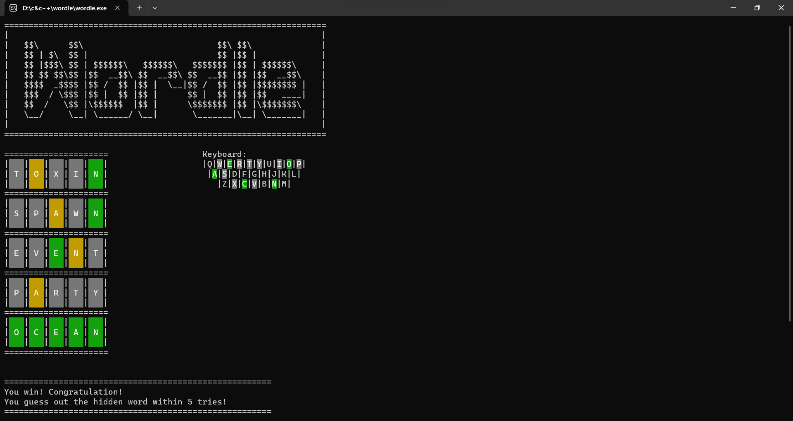

# Wordle with c++
- It's a wordle but you can play offline.
- And infinitely.
- If you want to play, just download the zip.
- Here's the preview:
        
# Introduction
- In this game, you need to guess the 5-letter hidden word in 6 tries.
- The background color of the letters changes to show how close you are.
  - GREY means the letter is not in the target word at all.
  - YELLOW means the letter is in the word but in the wrong spot.
  - GREEN means the letter is in the word and in the right spot.
## Something doesn't make sense:D
- I attempt to segment words in a lexicographical order with the hope of speeding up the program...
- But actually I cannot notice any improvement using today's computer:D
- Is it essential?
